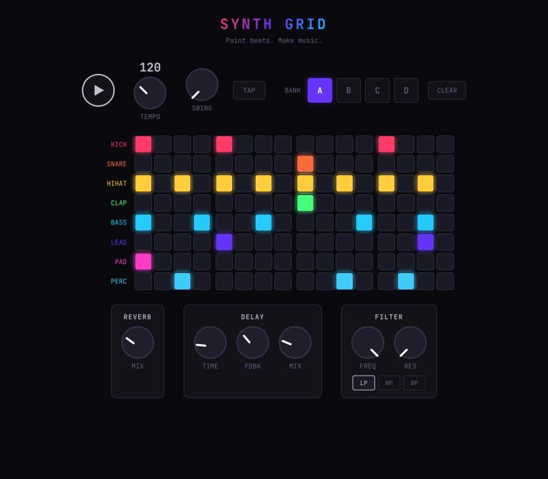

# Synth Grid

A browser-based visual music step sequencer. Paint beats on an 8×16 grid — each row is a synthesized instrument, each column is a 16th note. Hit play and watch your pattern come to life with glowing cells, particle effects, and music made entirely from Web Audio API oscillators.

**Zero runtime dependencies. Pure synthesis.**



## Features

- **8 synthesized instruments** (kick, snare, hi-hat, clap, bass, lead, pad, perc) with per-instrument sound shaping (ADSR, waveform)
- **Per-row sample loading** via drag-and-drop with waveform preview and trim
- **Per-step velocity** (3 levels), probability, ratchets, trig conditions, and gate lengths
- **Piano roll** for melodic rows (bass, lead, pad) with scale-aware note input
- **Automation lanes** for per-step volume, pan, reverb send, and delay send
- **4 pattern banks** (A–D) with copy/paste, pattern chain (song mode), and mute scenes
- **Effects chain**: reverb, tempo-synced delay, filter, tape saturation, 3-band EQ, sidechain ducking
- **Performance FX**: tape stop, stutter, bitcrush, reverb wash (hold-to-engage)
- **MIDI I/O**: input triggering, CC learn, clock sync (send/receive 24ppqn), per-row output config
- **Euclidean rhythm generator**, polyrhythm (per-row step length 1–16), and density randomizer
- **State persistence**: URL sharing, localStorage auto-save, IndexedDB sample storage
- **PWA** with offline support, 4 themes, comprehensive keyboard shortcuts, touch-optimized UI

## Getting Started

```bash
git clone https://github.com/alexpulich/synth-grid.git
cd synth-grid
npm install
npm run dev
```

Open [http://localhost:5173](http://localhost:5173) in a Chromium-based browser (required for Web MIDI and full Web Audio support). Click cells to toggle them, hit play, and make music.

## Commands

```bash
npm run dev        # Start dev server (port 5173)
npm run build      # Type-check + build for production
npx tsc --noEmit   # Type-check only
npm test           # Run test suite (~438 tests)
npm run lint       # ESLint (zero violations)
```

## Tech Stack

- **TypeScript** — strict mode, vanilla (no frameworks)
- **Vite** — dev server and production bundler
- **Web Audio API** — all synthesis, effects, and sample playback
- **Web MIDI API** — device I/O and clock sync
- **Canvas API** — particle effects and waveform visualization
- **Vitest** — test framework (node environment, colocated test files)
- **ESLint** — flat config with TypeScript plugin

## Architecture

The app uses a typed event bus (`EventMap`) for all cross-component communication — components never reference each other directly. The main wiring hub is `src/ui/app.ts`.

See [CLAUDE.md](./CLAUDE.md) for the full architecture tree, key patterns, and gotchas.

## About This Project

This project was conceived and built entirely by [Claude](https://claude.ai) (Anthropic's AI assistant). Given creative freedom and an empty directory, Claude designed the full architecture and wrote every line of code — including audio synthesis, the scheduling engine, UI components, and visual effects.

## License

MIT
